# Secure Vault Tokenizer

Plateforme de démonstration pour tokeniser des données sensibles. Le tokenizer FastAPI applique une FPE FF3-1, chiffre la valeur avec AES-256-GCM (PyCryptodome) et la gateway .NET protège chaque DEK avec Vault Transit avant persistance PostgreSQL.

## Architecture

| Composant | Rôle | Port local |
| --- | --- | --- |
| Dashboard React | Connexion administrateur, clés API, graphiques et playground | `5173` |
| Gateway .NET | JWT, autorisation par clé API, orchestration Vault/PostgreSQL | `8080` |
| Tokenizer FastAPI | FPE FF3-1 et chiffrement AES-256-GCM via PyCryptodome | `8001` |
| PostgreSQL | Clients, empreintes des clés API, tokens chiffrés, audits | `5432` |
| Vault Transit | Chiffrement et déchiffrement des valeurs | `8200` |
| Redis | Rate limiting par clé API et par minute | `6379` |

## Prérequis locaux (sans Docker)

- .NET SDK 8
- Python 3.12
- Node.js 18 ou supérieur
- PostgreSQL 16 ou supérieur, avec `psql` disponible dans le terminal
- Vault CLI / serveur. Téléchargement : [PostgreSQL pour Windows](https://www.postgresql.org/download/windows/) et [Vault pour Windows](https://developer.hashicorp.com/vault/install).
- Redis (Install it in wsl)

Les valeurs ci-dessous sont réservées au développement local :

| Paramètre | Valeur de développement |
| --- | --- |
| PostgreSQL | base `secure_vault`, utilisateur `secure`, mot de passe `secure` |
| Vault | `http://127.0.0.1:8200`, token `root` |
| FPE key | `FPE_KEY` : clé hexadécimale 256 bits injectée dans Vault KV |
| Administrateur | `admin@securevault.local` / `ChangeMe123!` |

Changez les secrets `Jwt:Key`, `Admin:Password` et le token Vault avant un déploiement réel.

## Démarrage local complet

Ouvrez cinq terminaux. Les commandes suivantes sont prévues pour Git Bash sous Windows.

### 1. Initialiser PostgreSQL

Installez PostgreSQL, démarrez son service Windows, puis créez la base et l'utilisateur avec le compte administrateur choisi à l'installation :

```bash
psql -h 127.0.0.1 -U postgres
```

```sql
CREATE USER secure WITH PASSWORD 'secure';
CREATE DATABASE secure_vault OWNER secure;
\q
```

Depuis la racine du dépôt, créez les tables :

```bash
export PGPASSWORD=secure
psql -h 127.0.0.1 -U secure -d secure_vault -f db/init/01-init.sql
```

### 2. Démarrer et préparer Vault Transit

Dans le deuxième terminal :

```bash
vault server -dev -dev-root-token-id=root
```

Laissez ce terminal ouvert. Dans le troisième terminal :

```bash
export VAULT_ADDR=http://127.0.0.1:8200
export VAULT_TOKEN=root
vault secrets enable transit
vault write -f transit/keys/tokenizer
vault kv put secret/tokenizer fpe_key="$FPE_KEY"
```

Le dernier message doit confirmer la création de la clé `tokenizer`. Vault Transit est le seul composant qui peut déchiffrer les valeurs d'origine.

### 3. Démarrer Redis

Redis est utilisé pour appliquer le quota par minute de chaque clé API. Sous Windows, installez-le avec WSL2 : Redis recommande WSL ou son partenaire Windows Memurai pour une exécution locale. [Guide officiel Redis pour Windows](https://redis.io/docs/latest/operate/oss_and_stack/install/archive/install-redis/install-redis-on-windows/)

1. Ouvrez **PowerShell en administrateur**, installez WSL avec Ubuntu, puis redémarrez Windows si demandé :

```powershell
wsl --install -d Ubuntu
```

2. Ouvrez l'application **Ubuntu** depuis le menu Démarrer, créez votre utilisateur Linux, puis installez Redis :

```bash
sudo apt-get install lsb-release curl gpg
curl -fsSL https://packages.redis.io/gpg | sudo gpg --dearmor -o /usr/share/keyrings/redis-archive-keyring.gpg
sudo chmod 644 /usr/share/keyrings/redis-archive-keyring.gpg
echo "deb [signed-by=/usr/share/keyrings/redis-archive-keyring.gpg] https://packages.redis.io/deb $(lsb_release -cs) main" | sudo tee /etc/apt/sources.list.d/redis.list
sudo apt-get update
sudo apt-get install redis
```

3. Démarrez Redis dans Ubuntu et vérifiez la connexion :

```bash
redis-server --daemonize yes
redis-cli ping
```

Résultat attendu : `PONG`. WSL2 expose normalement Redis à Windows sur `127.0.0.1:6379`, ce qui correspond déjà à `Redis:ConnectionString` dans `appsettings.json`.

4. Vérifiez depuis Git Bash ou PowerShell que le port est accessible avant de démarrer la gateway :

```powershell
Test-NetConnection 127.0.0.1 -Port 6379
```

Résultat attendu : `TcpTestSucceeded : True`. Si votre serveur Redis écoute sur un autre hôte ou port, remplacez `Redis:ConnectionString` dans `appsettings.json` par exemple par `127.0.0.1:6380`.

### 4. Démarrer le tokenizer

Dans le quatrième terminal :

```bash
cd services/tokenizer
python -m venv .venv
source .venv/Scripts/activate
pip install -r requirements.txt
uvicorn app.main:app --host 127.0.0.1 --port 8001 --reload
```

Vérifiez que `http://localhost:8001/health` répond avec `"status":"ok"`.

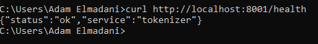

### 5. Démarrer la gateway

Dans le cinquième terminal :

```bash
cd services/gateway/SecureVaultGateway
dotnet restore
dotnet run --urls http://localhost:8080
```

Vérifiez :

```bash
curl http://localhost:8080/health
```

Résultat attendu :

```json
{"status":"ok","service":"gateway"}
```

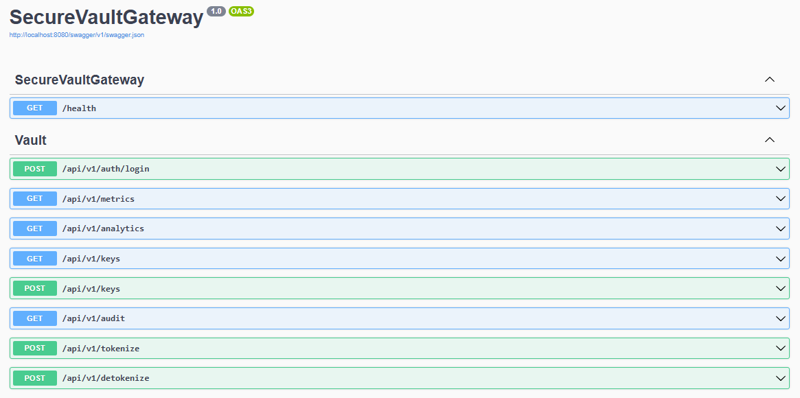

### 6. Démarrer le dashboard

Dans un nouveau terminal :

```bash
cd services/dashboard
npm install
npm run dev -- --host 127.0.0.1 --port 5173
```

Ouvrez `http://localhost:5173` et connectez-vous avec `admin@securevault.local` et `ChangeMe123!`.

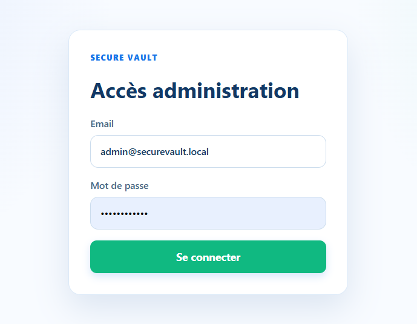
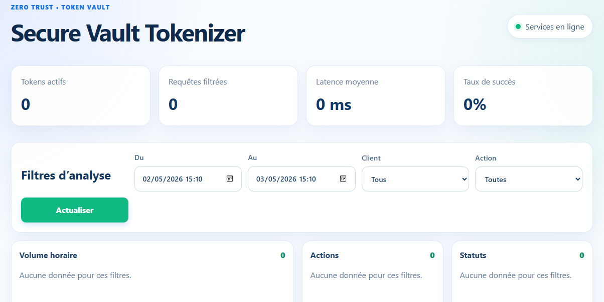

## Parcours de test fonctionnel

### A. Créer une clé API

1. Dans la section **API Keys**, choisissez un nom, le scope `TOKENIZE + DETOKENIZE` et une limite.
2. Cliquez sur **Créer**.
3. Copiez immédiatement la valeur commençant par `svt_` : elle n'est affichée qu'une fois.
4. Cette clé est automatiquement placée dans le champ **Clé API active** du playground.

Résultat attendu : la nouvelle clé apparaît dans la liste avec son quota. La valeur brute ne réapparaît pas dans la liste, car PostgreSQL ne conserve que son empreinte SHA-256.

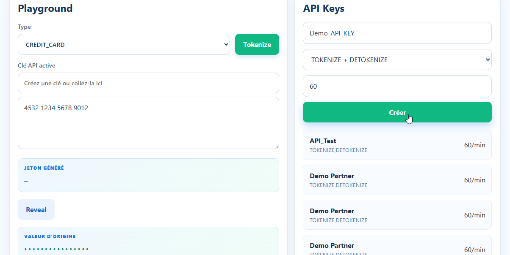

### B. Tokeniser une valeur

1. Choisissez `CREDIT_CARD`.
2. Saisissez une carte de test valide Luhn, par exemple `4242 4242 4242 4242`.
3. Cliquez sur **Tokenize**.

Résultat attendu :

- un jeton différent de la carte s'affiche ;
- la valeur originale reste masquée ;
- une entrée `TOKENIZE` avec le statut `success` est ajoutée à l'audit ;
- le compteur des requêtes et le graphique de volume progressent.

Vous pouvez aussi tester :

| Type | Valeur de test |
| --- | --- |
| `EMAIL` | `alice@example.com` |
| `PHONE` | `+33 6 12 34 56 78` |

Une carte non conforme au contrôle Luhn doit renvoyer une erreur de validation : c'est le comportement attendu.

Pour valider le quota Redis, créez une clé avec une limite de `1`, tokenisez une première valeur (succès), puis une seconde dans la même minute. La seconde réponse doit être `429 Too Many Requests`. Redis crée une clé temporaire `rate-limit:<client>:<minute>` qui expire automatiquement.

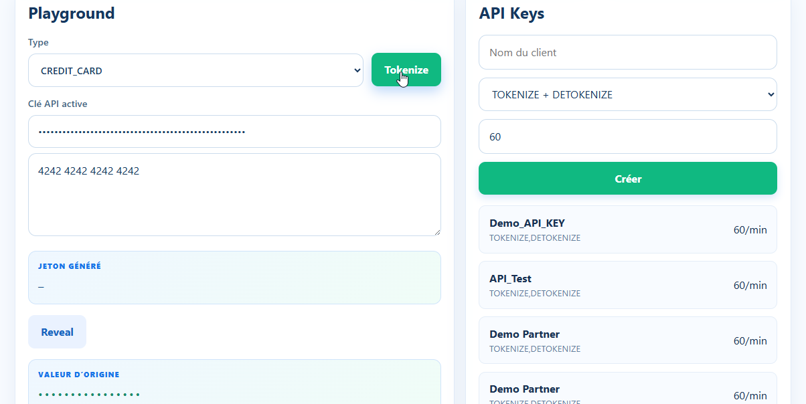

### C. Détokeniser une valeur

Après une tokenisation réussie, cliquez sur **Reveal**.

Résultat attendu : la valeur d'origine exacte est affichée. Le flux est : token -> PostgreSQL (chiffré Vault) -> Vault Transit -> valeur claire. Un audit `DETOKENIZE` est ajouté.

Si vous modifiez le token ou utilisez une clé qui ne possède pas le scope `DETOKENIZE`, la requête doit échouer avec `404` ou `401`. C'est le comportement attendu.


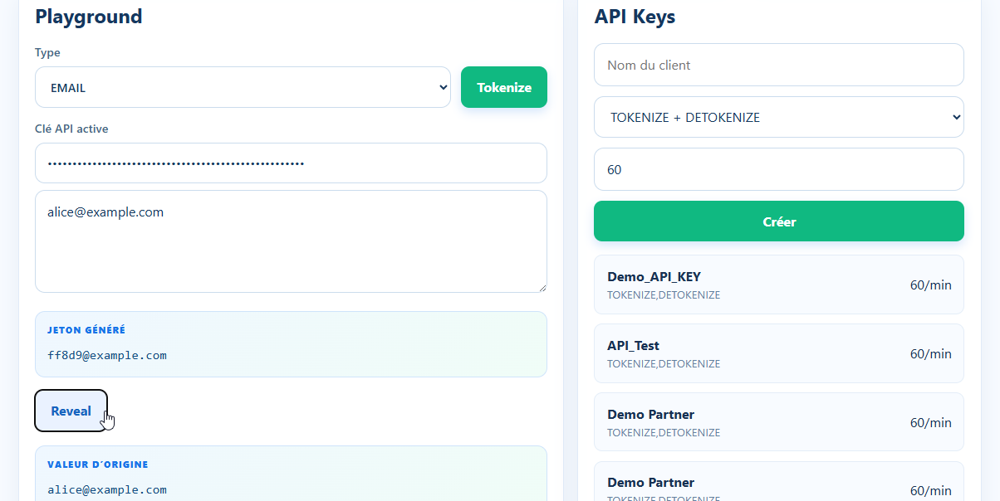

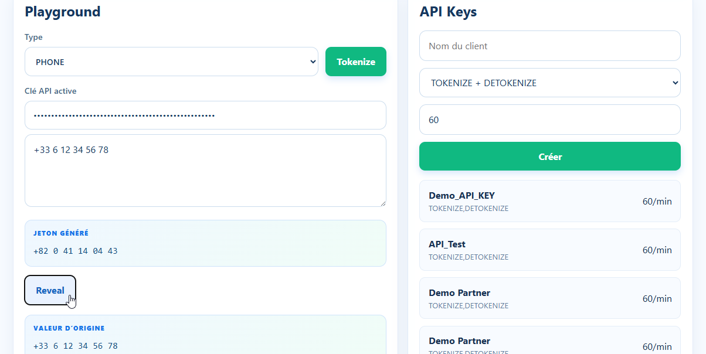

### D. Tester les filtres et graphiques

1. Réalisez plusieurs tokenisations et détokenisations.
2. Modifiez la période, le client ou l'action dans **Filtres d'analyse**.
3. Cliquez sur **Actualiser**.

Résultat attendu : les cartes de métriques, le volume horaire, les répartitions par action/statut et le tableau d'audit ne montrent que les événements correspondants.

## Vérifications techniques

Vérifiez les données stockées sans exposer de valeur sensible :

```bash
export PGPASSWORD=secure
psql -h 127.0.0.1 -U secure -d secure_vault
```

```sql
SELECT token_id, format_type, encrypted_payload FROM vault_records;
SELECT client_id, action, status, duration_ms, timestamp FROM audit_logs ORDER BY timestamp DESC;
SELECT client_id, name, api_key_hash FROM clients;
```

Résultats attendus :

- `encrypted_dek` commence par `vault:v1:` et `encrypted_payload` est un payload AES-GCM ; aucune valeur claire ne doit être présente dans `vault_records` ;
- `api_key_hash` est une empreinte hexadécimale, jamais une clé `svt_` en clair ;
- `audit_logs` contient les actions, leur statut et la latence, sans valeur sensible.

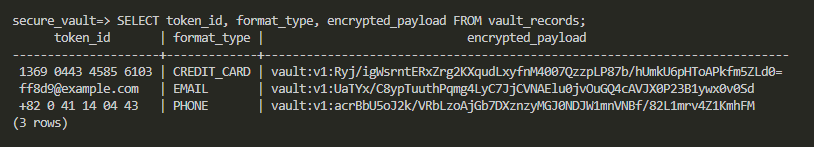

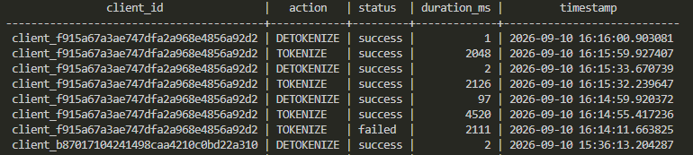

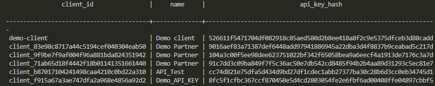

## Tester l'API sans dashboard

Le dashboard est l'option la plus simple car il récupère le JWT et la clé API. Pour tester l'API directement, connectez-vous d'abord :

```bash
curl -X POST http://localhost:8080/api/v1/auth/login \
  -H 'Content-Type: application/json' \
  -d '{"email":"admin@securevault.local","password":"ChangeMe123!"}'
```

Utilisez le champ `accessToken` reçu comme jeton Bearer pour créer une clé. Ensuite, remplacez `YOUR_API_KEY` par la clé retournée :

```bash
curl -X POST http://localhost:8080/api/v1/tokenize \
  -H 'Content-Type: application/json' \
  -H 'X-API-Key: YOUR_API_KEY' \
  -d '{"type":"EMAIL","value":"alice@example.com"}'
```

La réponse contient un `token`, un `formatType` et `status: "success"`, mais jamais `value` ni `originalValue`.

## Validation du code

```bash
cd services/gateway/SecureVaultGateway && dotnet build -c Release
cd services/tokenizer && python -m compileall app
cd services/dashboard && npm run build
```

## Docker (optionnel)

Si Docker Desktop est disponible, la stack complète peut également être démarrée depuis la racine :

```bash
docker compose up --build
```

Redis est automatiquement démarré par Compose sous le nom de service `redis`. Pour démarrer uniquement Redis dans la stack :

```bash
docker compose up -d redis
docker compose exec redis redis-cli ping
```

Résultat attendu : `PONG`.

Pour supprimer les données Docker de démonstration :

```bash
docker compose down -v
```

Ne lancez jamais Vault en mode `-dev` dans un environnement de production.

## License

This project is licensed under the MIT License - see the [LICENSE](LICENSE) file for details.
